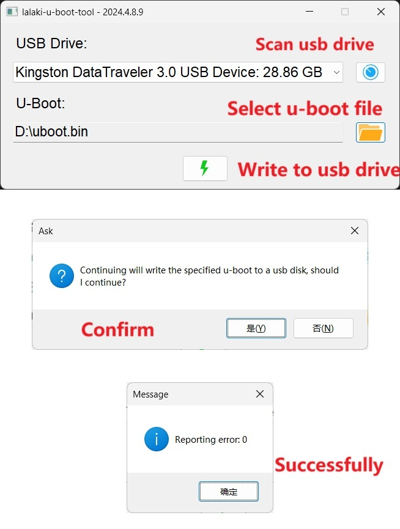

# lalaki-u-boot-tool

[](https://ru.wikipedia.org/wiki/.EXE)

[English](README.md)  | [中文](README_zh.md)

为了能在Windows上轻松烧录u-boot，我开发了这个工具。

实现了与下列命令相似的功能。

```shell

dd bs=1k seek=8 if=u-boot.bin of=/dev/sd?
```

现在，你可以在windows上轻松烧录u-boot。

## Demo


by lalaki.cn